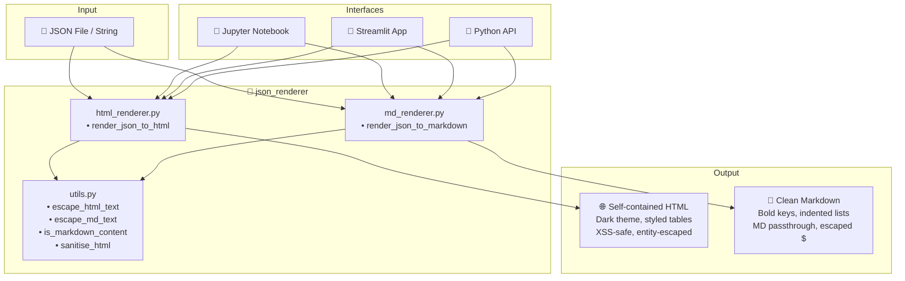

# 🎨 JsonRenderer

**Safely render arbitrary JSON to HTML and Markdown** — handles unicode, dollar signs, embedded markdown, XSS payloads, and every edge case that typically breaks renderers.

[](https://python.org)
[](https://docs.astral.sh/uv/)
[](LICENSE)

---

## 🏗️ Architecture



## 🗺️ Roadmap

```mermaid
graph LR
    A["Phase 1\nProject Scaffold"] --> B["Phase 2\nCore Rendering Skills"]
    B --> C["Phase 3\nEdge-Case Hardening"]
    C --> D["Phase 4\nTest Fixtures & Tests"]
    D --> E["Phase 5\nJupyter Notebook"]
    E --> F["Phase 6\nREADME & Docs"]
    F --> G["Phase 7\nStreamlit Demo"]

    style A fill:#1a1d2e,stroke:#818cf8,color:#e2e8f0
    style B fill:#1a1d2e,stroke:#818cf8,color:#e2e8f0
    style C fill:#1a1d2e,stroke:#818cf8,color:#e2e8f0
    style D fill:#1a1d2e,stroke:#818cf8,color:#e2e8f0
    style E fill:#1a1d2e,stroke:#818cf8,color:#e2e8f0
    style F fill:#1a1d2e,stroke:#818cf8,color:#e2e8f0
    style G fill:#1a1d2e,stroke:#818cf8,color:#e2e8f0
```



| Phase | Description |
|-------|-------------|
| **1 — Scaffold** | `pyproject.toml` with uv, package structure, dependency declarations |
| **2 — Core Skills** | `html_renderer.py` and `md_renderer.py` — the two rendering engines |
| **3 — Hardening** | Shared `utils.py` with escaping, sanitisation, and markdown detection |
| **4 — Test Fixtures** | `complex.json` adversarial test data + comprehensive pytest suite |
| **5 — Notebook** | `demo.ipynb` showing both skills with edge-case verification |
| **6 — Docs** | This README with architecture & roadmap diagrams |
| **7 — Streamlit** | Interactive demo app with upload, preview, and download |

---

## 🚀 Quickstart

### Prerequisites

- Python 3.10+
- [uv](https://docs.astral.sh/uv/) package manager

### Install & Run

```bash
# Clone the repo
git clone <repo-url>
cd JsonRenderer

# Install with uv (creates venv automatically)
uv sync

# Run tests
uv run pytest tests/ -v

# Launch Streamlit demo
uv sync --extra demo
uv run streamlit run app.py

# Launch Jupyter notebook
uv sync --extra dev
uv run jupyter notebook notebooks/demo.ipynb
```

---

## 📖 API Reference

### Skill 1: JSON → HTML

```python
from json_renderer import render_json_to_html

data = {"price": "$99", "emoji": "🎉", "md": "**bold** text"}
html = render_json_to_html(data, title="My Document")

# Returns a self-contained HTML document string
with open("output.html", "w", encoding="utf-8") as f:
    f.write(html)
```

**Features:**
- Self-contained HTML with inline CSS (dark theme)
- XSS payloads neutralised (`<script>` tags stripped)
- Dollar signs escaped to `&#36;` (prevents LaTeX/MathJax)
- Embedded markdown converted to safe HTML via `markdown` + `bleach`
- Full unicode support (emoji, CJK, RTL, combining chars)

### Skill 2: JSON → Markdown

```python
from json_renderer import render_json_to_markdown

data = {"price": "$99", "emoji": "🎉", "md": "**bold** text"}
md = render_json_to_markdown(data, title="My Document")

# Returns a Markdown string
with open("output.md", "w", encoding="utf-8") as f:
    f.write(md)
```

**Features:**
- Clean, readable Markdown with bold keys
- Embedded markdown in values passed **as-is** (no double-processing)
- Dollar signs escaped to `\$` (prevents LaTeX rendering)
- Special Markdown characters in keys escaped
- Full unicode support

---

## 🛡️ Edge-Case Coverage

| Edge Case | HTML Handling | Markdown Handling |
|-----------|---------------|-------------------|
| **Unicode (emoji, CJK, RTL)** | Preserved as-is | Preserved as-is |
| **Dollar signs (`$`, `$$`)** | Entity-escaped → `&#36;` | Backslash-escaped → `\$` |
| **XSS (`<script>`)** | Stripped by bleach | Entity-escaped |
| **Embedded Markdown** | Converted to safe HTML | Passed as-is |
| **HTML in values** | Entity-escaped | Entity-escaped |
| **Empty values** | Graceful `{ }` / `[ ]` | Graceful `*empty*` |
| **Deep nesting** | Recursive tables | Indented lists |
| **Special chars in keys** | HTML-entity-escaped | Backslash-escaped |
| **Backslashes, pipes** | Entity-escaped | Backslash-escaped |
| **Null bytes, BOM** | Preserved safely | Preserved safely |

---

## 📁 Project Structure

```
JsonRenderer/
├── pyproject.toml              # uv-compatible project config
├── README.md                   # This file
├── app.py                      # Streamlit demo app
├── .streamlit/
│   └── config.toml             # Streamlit dark theme
├── src/
│   └── json_renderer/
│       ├── __init__.py         # Package init, public API
│       ├── html_renderer.py    # Skill 1: JSON → HTML
│       ├── md_renderer.py      # Skill 2: JSON → Markdown
│       └── utils.py            # Shared escaping & sanitisation
├── tests/
│   ├── fixtures/
│   │   └── complex.json        # Adversarial test data
│   ├── test_html_renderer.py   # HTML renderer tests
│   └── test_md_renderer.py     # Markdown renderer tests
└── notebooks/
    └── demo.ipynb              # Interactive demo notebook
```

---

## 🧪 Running Tests

```bash
uv run pytest tests/ -v
```

The test suite covers:
- ✅ HTML document structure validation
- ✅ XSS protection (script tags, event handlers)
- ✅ Dollar sign escaping (single, double, triple)
- ✅ Unicode preservation (emoji, CJK, RTL, ZWJ, combining chars)
- ✅ Nested structure rendering (5+ levels)
- ✅ Empty value handling
- ✅ Embedded markdown processing
- ✅ Primitive type rendering (bool, null, numbers)

---

## 📄 License

MIT
